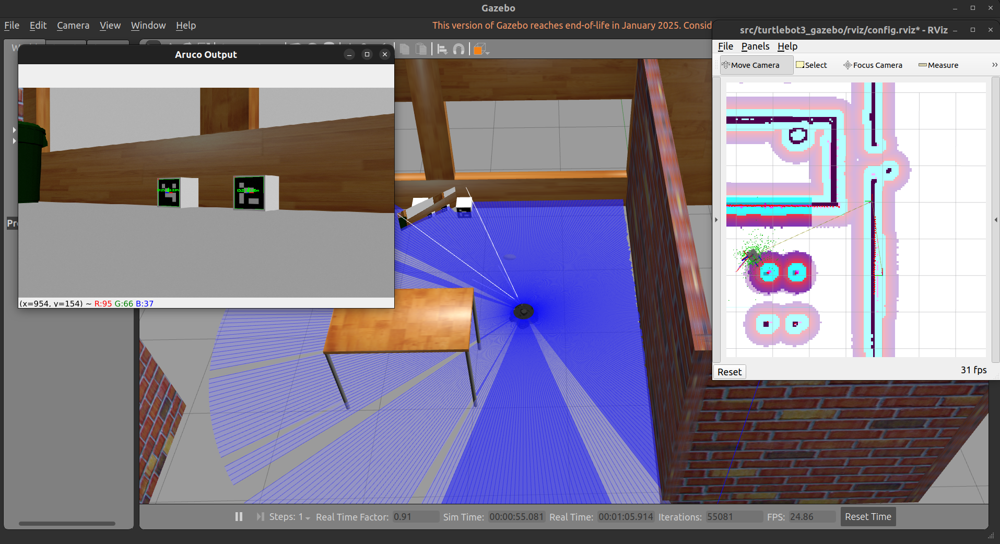

# ArUco-Based Autonomous Docking with TurtleBot3 in ROS 2

This project demonstrates autonomous robot navigation and docking using ArUco markers and a TurtleBot3 in a Gazebo simulation, built using **ROS 2 Humble**.

The robot:
- Navigates through predefined goals using `nav2`
- Detects ArUco markers from a camera feed
- Aligns and docks using camera + LIDAR feedback

## Project Structure

```bash
ros2_ws/
├── src/
│   ├── docking_controller/     # Your docking controller node + custom msg
│   ├── aruco_detector/         # ArUco detection node (OpenCV + tf2)
│   └── turtlebot3_gazebo/      # TurtleBot3 simulation and map
````

## Installation Instructions

### 1. Set up your workspace

```bash
git clone https://github.com/tejaswisam/autonomous_docking_ros2/tree/main
```

### 2. Install dependencies

```bash
sudo apt update
sudo apt install ros-humble-turtlebot3* \
                 ros-humble-nav2-bringup \
                 ros-humble-cv-bridge \
                 ros-humble-tf2-geometry-msgs \
                 python3-opencv \
                 ros-humble-vision-msgs
```

### 3. Build and Source

```bash
cd ~/ros2_ws
colcon build
source install/setup.bash
```

You can add the source line to your `.bashrc`:

```bash
echo "source ~/ros2_ws/install/setup.bash" >> ~/.bashrc
```

---

## How to Launch

Run each command in a **separate terminal** (all from `ros2_ws` root):

### 1. Launch Gazebo world

```bash
ros2 launch turtlebot3_gazebo turtlebot3_house.launch.py
```

---

### 2. Estimate Initial Pose

```bash
ros2 run docking_controller pose_estimator_node
```

---

### 3. Start ArUco Detection Node

```bash
ros2 run aruco_detector aruco_node
```

---

### 4. Bring up Navigation2

```bash
ros2 launch nav2_bringup bringup_launch.py use_sim_time:=true map:=src/turtlebot3_gazebo/maps/my_house.yaml
```

---

### 5. Start Docking Controller Node

```bash
ros2 run docking_controller controller_node
```

---

### 6. Open RViz

```bash
rviz2 -d src/turtlebot3_gazebo/rviz/config.rviz
```

---

### 7. Trigger Docking for Specific ArUco ID

```bash
ros2 topic pub /aruco_marker_id std_msgs/msg/Int64 "{data: 25}"
```

This tells the controller to latch onto marker `25` and initiate docking when it is detected.

---

## How It Works

* The robot navigates to predefined waypoints.
* Once completed, it waits for ArUco marker detection.
* When `/aruco_marker_id` is published, it locks onto that ID.
* The `controller_node` continuously aligns the robot using:

  * ArUco marker pose (camera frame)
  * Front LIDAR for precise stop
* Docking completes when the robot is centered, aligned, and within threshold.

---

## Tested On

* ROS 2 **Humble**
* Ubuntu 22.04
* OpenCV ≥ 4.7
* Gazebo with TurtleBot3
* Rviz2, tf2\_ros, nav2, image\_transport, cv\_bridge

---

## Screenshots




---